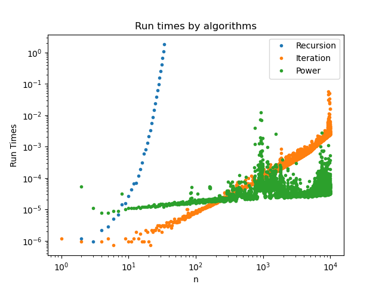

# Answers

Put any answers to questions in the assignment in this file, or any commentary you don't include in the code.

This is a markdown file (the `.md` extension gives it away). If you have never used markdown before, check out [this short guide](https://guides.github.com/features/mastering-markdown/).

## Problem 0
You don't need to say anything here.  Just complete [`fizzbuzz.py`](fizzbuzz.py).

## Problem 1
We have done `[log2(n)]+(#(n)-1)` additions in the Egyptian multiplication algorithm. Here, `[log2(n)]` indicates the largest integer smaller than (or equal to) `log2(n)`;`#(n)` indicates the number of non-zero bits of `n`. Each time we calculate the `n//2`, we have one recurion. Hence, we have `[log2(n)]` levels of recursion here. Besides, every time we have a 1 in the binary representation of n (except the first 1), we will have an additional `+a`. In sum, We have `[log2(n)]+(#(n)-1)` additions.

## Problem 2
Asymptotically, the **iterative** approach will be faster than the **recursive**  approach. For the iterative approach, the time complexity is `O(n)`. For example, `fibonacci(4)=fibonacci(0)+fibonacci(1)+fibonacci(2)+fibonacci(3)`, where the loop calls the function 4 times. However, for the recursive approach, the time complexity expotentially increases. For example, `fibonacci(4)` calls the function 9 times, with `fibonacci(4)` once, `fibonacci(3)` once, `fibonacci(2)` twice, `fibonacci(1)` for three times and `fibonacci(0)` twice.

## Problem 3
For each time we uses the matrix multiplication, we can compute within `O(1)`. Since we compute the power with the Egyptian algorithm, each time we compute the `n//2` we will have one operation. Hence, the asymptotic number of operations done in this algorithm will be `O(log2(n))`.

Compared with the algorithms in Problem 2, the matrix power algorithm can be much faster than the recursive approach. Besides, when `n` is not large, the computing complexity of power algorithm can be similiar to the interation. When `n` gets larger, power algorithm will perform better than the iterative approach.

The **potential issues** with large values of `n` in the matrix power algorithm:
Since Numpy uses the binary floating point representation, there can be precision lost, which makes the output slightly different from the true value. When `n` gets large, the loss of precision will increase. Therefore, I think it would be better to use `np.int64` in arrays for large values of `n`.

## Problem 4
The plot of run times of three Fibonacci algorithm:

## Feedback
