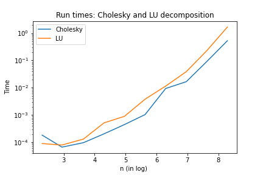
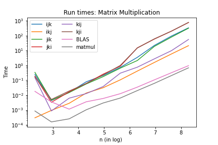
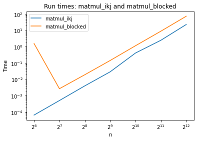
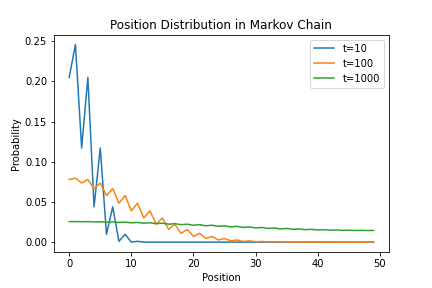

# Answers

Put any answers to questions in the assignment in this file, or any commentary you don't include in the code.

This is a markdown file (the `.md` extension gives it away). If you have never used markdown before, check out [this short guide](https://guides.github.com/features/mastering-markdown/).

## Problem 0

# Part B

Time for the Cholesky decomposition vs. the LU decomposition:

Both factorizations take O(n^3) time to compute, and the Cholesky decomposition is faster in practice.

# Part C

I expect this function to be asymptotically faster than the approach used in Homework 0.

Considering that the Fibonacci numbers are integers, since we have the binary floating point representation in matrix calculation, there can be precision lost, which makes the output slightly different from the true value. Additionally, When `n` gets large, the loss of precision will increase, and it would be better to use `int64`.

## Problem 1

# Part A

Compare the time it takes to run each of the 6 versions of `matmul_***` above with BLAS `gemm`  and NumPy `matmul`:

Among the `matmul_***`, the best one is `matmul_ikj` and the worst one is  `matmul_kij`. Besides, NumPy `matmul` and BLAS `gemm` are faster than the nested loops. `matmul` is the fastest among the eight functions.

Since the default setting in Python is row-major order, when accessing element row wise like `ikj`, this access is contiguous at the memory level. i.e. when you request `A[1,2]` after `A[1,1]`, this will already be in cache, and therefore no cache misses. However, when you accessing element column wise like `kji` and `jki`, they will miss the cache on every iteration, which make the loops much slower.

# Part B

Compare the time of Blocked Matrix Multiplication and `matmul_ikj`:

# Part C

Compare the time of `matmul_strassen` to `matmul_blocked`:

Yes, the Strassen's algorithm actually beats blocked matrix multiplication for the values of `n` thatI tested. Asymptotically, the run time of the Strassen's algorithm is `O(n**2.81)`, but the blocked matrix multiplication is `O(n**3)`

## Problem 2

Plot the vector `p` for `t in (10, 100, 1000)`:

The eigenvector with largest eigenvalue of the matrix A is `[0.02, 0.02, .., 0.02]`

The distance between this eigenvector and `p` at `t=1000` is `0.196195`

The distance between this eigenvector and `p` at `t=2000` is `0.027218`

## Feedback
