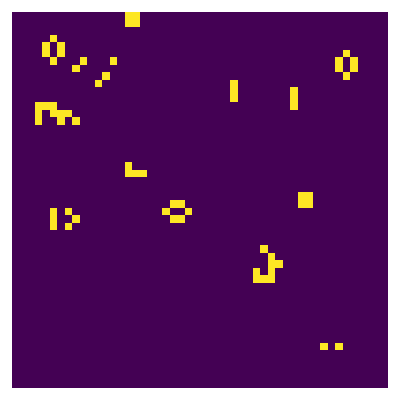
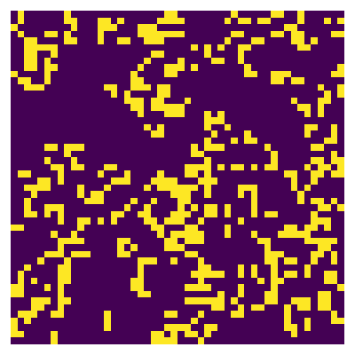
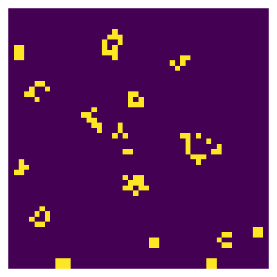

# Answers

Put any answers to questions in the assignment in this file, or any commentary you don't include in the code.

This is a markdown file (the `.md` extension gives it away). If you have never used markdown before, check out [this short guide](https://guides.github.com/features/mastering-markdown/).

## Problem 0

# Part A

a) Compute `k` so that `s[k]` is the same entry as `S[i,j]`:

The input is the `m` by `n` numpy array `S` and the multi-index`(i, j)`, and the output is the flat index `k` in the one-dimensional numpy array.

```python
def flat_index(S,i,j):
    '''
    Find the index of k of flatted array s, s.t. s[k] = S[i,j]
    '''
    m, n = S.shape
    index = np.array([i,j])
    k = np.ravel_multi_index(index, (m,n))
    
    return k
```
b) Compute `(i,j)` so that `S[i,j]` is the same entry as` s[k]`:

The input is the `m` by `n` numpy array `S` and the flat index `k`, and the output is the coordinate index `(i,j)` in `S`.

```python
def coordinate_index(S,k):
    '''
    Find the index of (i,j) of 2-dimensional array S, s.t. S[i,j] = s[k]
    '''
    m, n  = S.shape
    index = np.unravel_index(k,(m,n))
    i = index[0]
    j = index[1]
    
    return i,j
```

c) Turn the array `s` back into the 2-dimensional `S`:

We can directly use the function `np.reshape` with the one-dimensioanl array `s` and the shape `(m,n)` of `S`.

```python
S = np.reshape(s, (m, n))
```

# Part B

The return type of the adjacency matrix is the Dictionary Of Keys based sparse matrix. Since we are using the loop to calculate neighbors of each element `i`, Dictionary Of Keys based sparse matrix consists of a dictionary that maps (row, column)-pairs to the value of the elements and is good for incrementally construct a sparse matrix. Therefore, we construct the adjacency matrix in DOK format and then convert to other formats.

# Part C

a) It's time consuming when computing the adjacency matrix A. Consider the time used to compute the matrix multiplication `c = A @ s`:

|               |`csc_matrix`|`csr_matrix`|`dia_matrix`|
| :-----:       | :----:     | :----:     | :----:     |
|`(100 x 100)`  | 0.00086    | 0.00016    | 0.00016    |
|`(1000 x 1000)`| 0.02884    | 0.02063    | 0.02457    |

`csr_matrix` is the fastest on a 100 x 100 grid and `csr_matrix` is also the fastest on a 1000 x 1000 grid.

b) Compare the function `count_alive_neighbors` and `count_alive_neighbors_matmul`:

|               |`(100 x 100)` |`(1000 x 1000)`|
| :-----:       | :----:       | :----:        |
|`count_alive_neighbors`  | 0.25658    | 24.11696    |
|`count_alive_neighbors_matmul (csc_matrix)` | 0.00029    | 0.01889    |
|`count_alive_neighbors_matmul (csr_matrix)` | 0.00015    | 0.01903    | 
|`count_alive_neighbors_matmul (dia_matrix)` | 0.00016    | 0.01631    | 

We notice that the computation of adjacency matrix A is slow, but if we already have the adjacency matrix, `count_alive_neighbors_matmul` will be much faster than `count_alive_neighbors`. Though for the three types of sparse matrix the time is slightly different, they are all much faster than the function `count_alive_neighbors`.

# Part D

We compare the three functions, `count_alive_neighbors `, `count_alive_neighbors_matmul` and `count_alive_neighbors_slice`. In `count_alive_neighbors_matmul`, we use the `csc_matrix` format of sparse matrix.

|               |`(100 x 100)` |`(1000 x 1000)`|
| :-----:       | :----:       | :----:        |
|`count_alive_neighbors`  | 0.23007    | 23.53648    |
|`count_alive_neighbors_slice` | 0.00046    | 0.02972    |
|`count_alive_neighbors_matmul (csc_matrix)` | 0.00018    | 0.01793    | 

Hence, `count_alive_neighbors_slice` is much faster than `count_alive_neighbors`, but slightly slower than `count_alive_neighbors_matmul`. The advantage is that we don't need to calculate the adjacency matrix as the matrix multiplication method. 

In terms of memory access of `A` and `cts`, the `csc_matrix` and `csr_matrix` are the most similar to `count_alive_neighbors_slice`. Since the algorithm of the slice is like the translation of the matrix by column and by row, column-oriented operations `csc_matrix` and row-oriented operations `csr_matrix` would be more similar in terms of memory access. On the other hand, the `csc_matrix` and `csr_matrix` are efficient column slicing and row slicing respectively, they are more similiar to the slice.

# Part E

```python
np.random.seed(0)
S = np.random.rand(m, n) < 0.1
```



```python
np.random.seed(0)
S = np.random.rand(m, n) < 0.3
```



```python
np.random.seed(0)
S = np.random.rand(m, n) < 0.6
```




## Feedback
